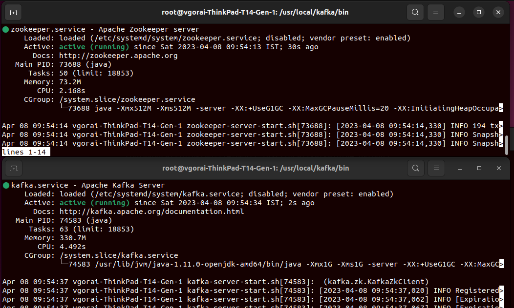

# Basic Kafka Usecase

This repository showcases the basic usecase of kafka in a bare minimum setup. 

## Prerequite : 
Please install and configure the config files for Apache Kafka and Zookeeper in your Ubuntu system before going ahead with this setup.
1. Install Kafka : [Link](https://kafka.apache.org/downloads)
2. Install Zookeeper : [Link](https://zookeeper.apache.org/releases.html)

## Contribution guidelines
The repository has 4 branches : 
1. Main
2. Topic
3. Producer
4. Consumer

# Running the setup 
Do ensure that before running the producer, consumers from this repository, the two services namely 'kafka.service' and 'zookeerper.service' should be in running state. 

For the purpose of feature addition, please switch to specific branch before adding your code changes.

# Expected feature additions
1. Adding a script 'setup.py' for automatic kafka and zookeeper installation.
2. replace the module 'os' with 'subprocess' within the scripts.
3. Add a switch to topicCreate.py to enable it to create multiple topics at once.

> Feel free to use the module, experiment with its features and suggest changes.

Thanks!